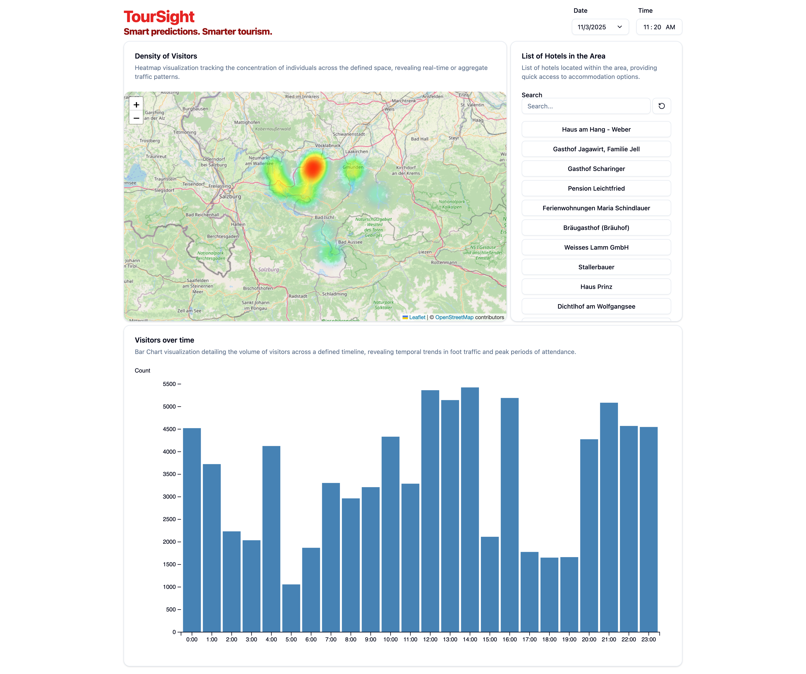

# TourSight

> A predictive model and dashboard for forecasting visitor traffic at points of interest. Built during the Tourism Technology Festival 3.0

**Note:** The original dataset used for this project is proprietary and cannot be shared. This repository provides the complete code pipeline, allowing you to train the model and run the dashboard using your own data, provided it matches the schema defined below.

---

## Dashboard Preview



## Features

* Machine learning model to predict visitor counts.
* Interactive dashboard to visualize historical data and future predictions.

---

## Technology Stack

* **Modeling:**  LightGBM, scikit-learn
* **Backend:** Flask
* **Dashboard:** D3, matplotlib
* **Data Processing:** Pandas, NumPy
---

## Data Schema

To use this project, you must provide your own data. The model pipeline expects your data to be in a specific format.

Your data **must** contain the following columns:

| Column Name | Data Type | Description |
| :--- | :--- | :--- |
| `installationId` | `string` | `Identifier of the Point of Interest (POI)` |
| `timestamp` | `datetime` | `Date and Time of the observation` |
| `value` | `integer` | `Amount of people located at the POI` |
| `Ort` | `string` | `Name of the location` |
| `Latitude` | `float` | `Latitude of the POI` |
| `Longitude` | `float` | `Longitude of the POI` |
| `temperature_2m` | `float` | `Temperature at 2m height` |
| `relative_humidity_2m` | `float` | `Relative humidity at 2m height` |
| `precipitation` | `float` | `Rain, Snow and Hail (mm)` |
| `wind_speed_10m` | `float` | `Wind speed at 10m (km/h)` |
| `cloud_cover_low` | `float` | `Low cloud coverage (%)` |
| `cloud_cover_mid` | `float` | `Medium cloud coverage (%)` |
| `wind_speed_10m` | `float` | `High cloud coverage (%)` |
---


## Weather data

This project uses the Open-Meteo v1 API to get weather data which used in the prediction model. For mor information on the API please refer to their documentation at https://open-meteo.com/en/docs.

 The script `batch/todaysWeather.py` takes the path to a CSV file as the first positional argument. The CSV file needs to have at least the 3 columns named `TrackerID`, `Latitude` and `Longitude`. The CSV file is using `;`as a seperator  and `,` as a comma file. The script will use the weather API for each row's coordinate and get save todays hourly weather as a CSV file.

 Minimal CSV example:
```csv
TrackerID;Latitude;Longitude
XISKO;47.83468443576882;13.1133425789364
```

## DataPipeline
This project is inteded to retrain the LightGBM model daily and fetching new weather data.
We have a more detailed documentation of the data pipeline [here](documentation/DataPipeline.md)

## Contributors


## License

All code in this repository is licensed under the MIT License.

All image assets and documentation in this repository is licensed under CC-BY-4.0 (Link to license: https://creativecommons.org/licenses/by/4.0/)

### MIT License

Copyright 2025 Georg Becker BSc., Sofiia-Khrystyna Borysiuk, Laura Cesar BSc., Ing. Xaver Drabik, Florian Schmid

Permission is hereby granted, free of charge, to any person obtaining a copy of this software and associated documentation files (the “Software”), to deal in the Software without restriction, including without limitation the rights to use, copy, modify, merge, publish, distribute, sublicense, and/or sell copies of the Software, and to permit persons to whom the Software is furnished to do so, subject to the following conditions:

The above copyright notice and this permission notice shall be included in all copies or substantial portions of the Software.

THE SOFTWARE IS PROVIDED “AS IS”, WITHOUT WARRANTY OF ANY KIND, EXPRESS OR IMPLIED, INCLUDING BUT NOT LIMITED TO THE WARRANTIES OF MERCHANTABILITY, FITNESS FOR A PARTICULAR PURPOSE AND NONINFRINGEMENT. IN NO EVENT SHALL THE AUTHORS OR COPYRIGHT HOLDERS BE LIABLE FOR ANY CLAIM, DAMAGES OR OTHER LIABILITY, WHETHER IN AN ACTION OF CONTRACT, TORT OR OTHERWISE, ARISING FROM, OUT OF OR IN CONNECTION WITH THE SOFTWARE OR THE USE OR OTHER DEALINGS IN THE SOFTWARE.
